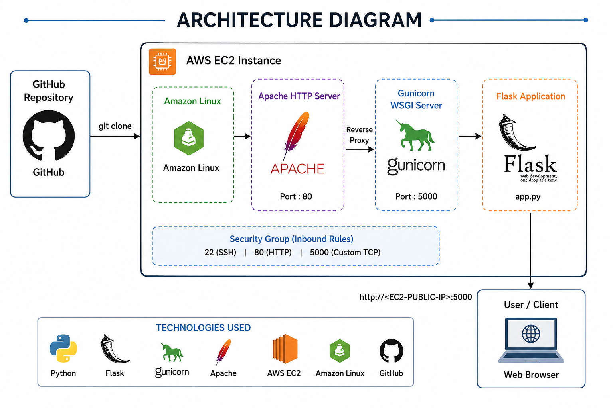

# 🚀 Python  Application Deployment on AWS EC2 using Apache & Gunicorn

# **Project Introduction**

**Python-App Deployment** is a web-based application developed using Python, where the application runs using a built-in server and can also be deployed using Gunicorn for production-level performance.

Project objective:

Launching and configuring AWS EC2 instances
Hosting Python web applications on Linux servers
Managing Python virtual environments
Installing and configuring Apache HTTP Server
Running Flask applications using Gunicorn WSGI server
Configuring security groups and networking
Using GitHub for source code management

# **1. Architecture Diagram**



```
⚙️ Technologies Used
🐍 Python 3
🌐 Flask
🔫 Gunicorn
☁️ AWS EC2
🔧 Apache HTTP Server
🐧 Amazon Linux
🗂️ Git & GitHub
```
```
📂 Project Structure
pythonapp/
│
├── app.py
├── requirements.txt
```
# 2. Instance Setup

## 2.1 Launch Instance


## 2.2 Names & OS

Name : `Python`

OS : `Amazon Linux`


## 2.3 AMI & Instance Type

AMI : `Default`

Architecture : `Default`

Instance Type : `t3.micro` (2CPU & 1GB Memory)


## 2.4 Key & Network

Key : `Pratik-Virginia-Key` (Exiting One)

Security Group : `Launch-Wizard-2` (Exiting One)


## 2.5 Start Instance


## 2.6 Connect


## 2.7 Copy SSH Client Link


# 3. Installing Packages


## 3.1 Connect Instance With Public IP

```jsx
ssh -i Pratik-Virginia-Key.pem ec2-user@54.161.38.170
```

## 3.2 Update Packages

```jsx
sudo yum update
```

## 3.3 Install Git

```jsx
sudo yum install git -y
```


## 3.4 Git Clone Repo

```jsx
git clone https://github.com/iamtruptimane/pythonapp
```

## 3.5 Install Python

```jsx
sudo yum install python3 -y
```


## 3.6 Install PIP

```jsx
sudo yum install python3-pip -y
```


## 3.7 View Git, Python & PIP Version

```jsx
git --versio
python --version
pip --version
```


# 4. Running Python App

## 4.1 Go To Directory Which Create Via Git Clone

```jsx
cd / pythonapp;
```


## 4.2 Create Virtual Environment (venv) Inside Project Folder

```jsx
sudo python3 -m venv myenv
```


## 4.3 Bash Activated venv

```jsx
sudo bash myenv/bin/activate
```


## 4.4 Install Requirements Inside Project Folder

```jsx
sudo pip install -r requirements.txt
```

## 4.5 To Run App (FrontGround)

```jsx
python3 app.py

If Press Ctrl + C → App Stops
```

## 4.6 To Run App In BackGround

```jsx
gunicorn --bind 0.0.0.0:5000 app:app --daemon
```

# 5. **Access** On Browser

## 5.1 To Add Port Number 5000

### 5.1.1 Go To Security Groups


### 5.1.2 Edit Inbound Rules


### 5.1.3 Add Rule → Type : Custom TCP → Port Range : 3000 → Source : Anywhere-IPv4 → Save Rules


## 5.2 Hit It On Browser And Put File Name

`public ip:5000`


```
# 🔥 Key Learnings

- AWS EC2 setup
- Linux server management
- Python virtual environments
- Flask application deployment
- Gunicorn configuration
- Apache server basics
- GitHub integration
```
# Summary
It Enables Users To Access The Application Through A Public IP On Port 5000, Demonstrating Basic Cloud Deployment And Application Hosting In A Structured Environment.