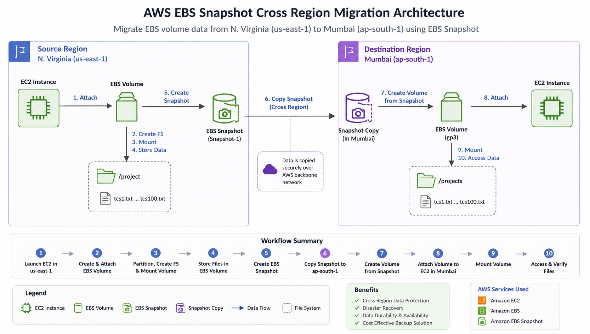
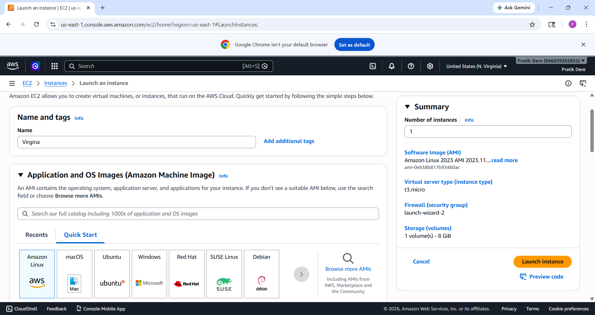
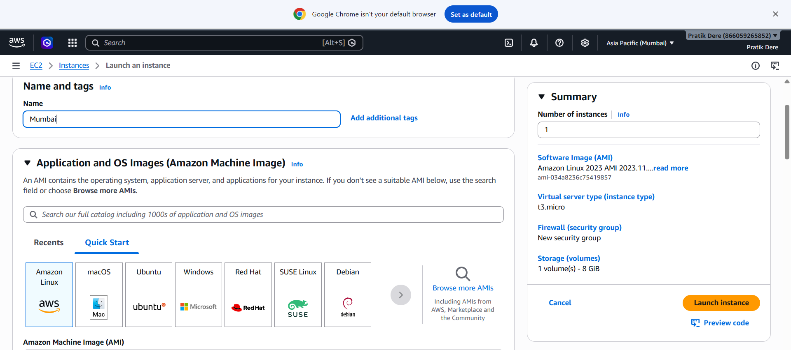
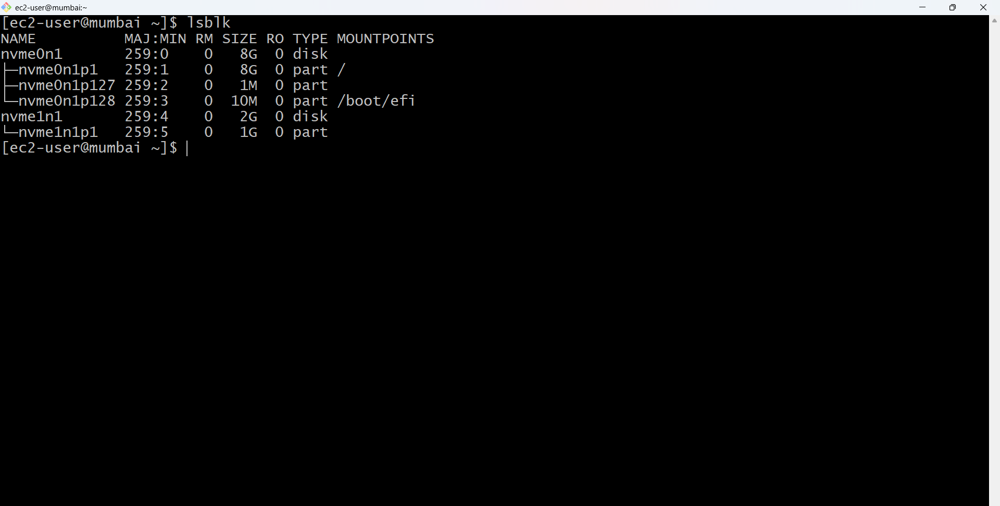
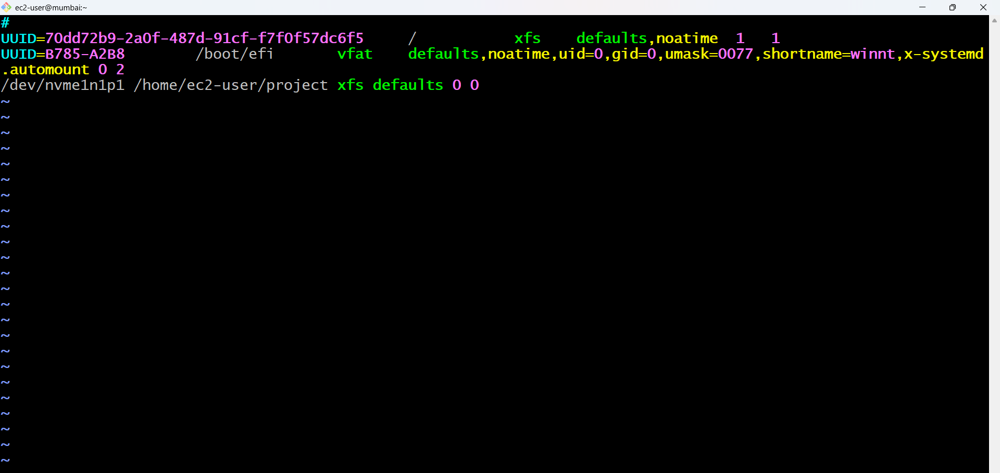

# AWS EBS Snapshot Cross Region Migration Project

## 📌 Project Overview

This project demonstrates how to:

- Launch EC2 instances in different AWS regions
- Create and attach EBS volumes
- Create partitions and filesystem
- Mount EBS volume
- Store files inside EBS
- Create snapshots
- Copy snapshots between regions
- Restore data in another region

---

# 🏗️ Architecture Diagram



---

# EBS SNAPSHOTS

---

# I. Launch Instance In N. Virginia Region

## 1. Launch EC2 Instance



---

## 2. Create & Attach Volume

### Create Volume


### Attach Volume


---

## 3. See The List Of All Block Storage Devices

### Command

```bash
lsblk
sudo blkid
```


---

## 4. Make Disk Partitions and Create Filesystem (XFS)

### Create Partition

```bash
sudo fdisk /dev/nvme1n1
```

### Inside fdisk

```bash
n
p
1
Enter
+1G
w
```


---

### Create Filesystem

```bash
sudo mkfs.xfs /dev/nvme1n1p1
```


---

## 5. Edit The System Filesystem Table

### Command

```bash
sudo vim /etc/fstab
```

### Add Entry

```bash
/dev/nvme1n1p1 /home/ec2-user/project xfs defaults 0 0
```


---

## 6. Mount EBS And Create Folder

### Commands

```bash
mkdir project
sudo mount /home/ec2-user/project
```


---

## 7. Create Files Inside Project Folder

### Commands

```bash
cd project
touch tcs{1..100}.txt
ls
```


---

# II. Create Snapshot

## 1. Action → Create Snapshot

### Navigate

```text
EC2 → Volumes → Actions → Create Snapshot
```


---

## 2. Go To Snapshots


---

## 3. Copy Snapshot To Mumbai Region

### Navigate

```text
Snapshots → Actions → Copy Snapshot
```


---

## 4. Configure Destination Region

### Select Region

```text
ap-south-1 (Mumbai)
```


---

# III. Launch New Instance In Mumbai Region

## 1. Switch To Mumbai Region



---

## 2. Check Snapshot


---

## 3. Create Volume From Snapshot

### Navigate

```text
Snapshots → Actions → Create Volume From Snapshot
```


---

## 4. Check Volumes And Attach

### Navigate

```text
Volumes → Actions → Attach Volume
```


---

## 5. Connect Mumbai EC2 And Show Disk

### Command

```bash
lsblk
```



---

## 6. Edit The System Filesystem Table

### Command

```bash
sudo vim /etc/fstab
```

### Add Entry

```bash
/dev/nvme1n1p1 /home/ec2-user/projects xfs defaults 0 0
```



---

## 7. Mount EBS Volume

### Commands

```bash
mkdir projects
sudo mount /home/ec2-user/projects
lsblk
```


---

## 8. Verify Restored Files

### Commands

```bash
ls
cd projects
ls
```


---

# ✅ Project Outcome

Successfully migrated EBS volume data from:

- N. Virginia Region (`us-east-1`)
➡️ to
- Mumbai Region (`ap-south-1`)

using AWS EBS Snapshots.

---

# 🛠️ AWS Services Used

- Amazon EC2
- Amazon EBS
- Amazon EBS Snapshot

---
